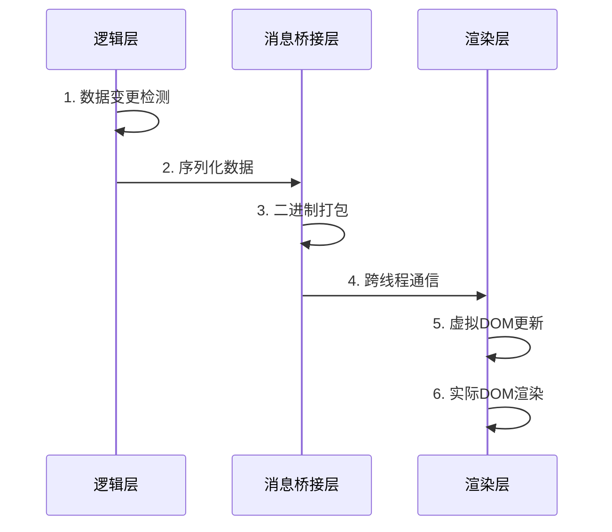

// MessageBridge 接口定义
interface MessageBridge {
// 发送消息到另一个线程
send(message: string): void;
// 监听另一个线程发来的消息
on(message: string, callback: (data: any) => void): void;
}

````

### 为什么需要双线程模型？

1. **安全性**
   - 隔离执行环境，防止恶意代码直接操作 DOM
   - 限制敏感 API 的访问权限
   - 提供安全的沙箱环境

2. **性能优化**
   - 分离计算任务和渲染任务
   - 避免 JavaScript 执行阻塞 UI 渲染
   - 支持并行处理提升效率

3. **跨端一致性**
   - 统一的渲染层抽象
   - 平台无关的通信机制
   - 一致的开发体验

4. **内存管理**
   - 线程级别的内存隔离
   - 更好的内存回收机制
   - 防止内存泄漏

::: warning 常见面试陷阱
1. 双线程不等于高性能，简单操作可能因通信开销反而更慢
2. 不要认为双线程就完全安全，仍需要做好权限控制
3. 注意区分 WebWorker 和双线程模型的区别
:::

## 核心实现

### 线程通信机制

```ts
// 逻辑层发送数据示例
class ServiceBridge implements MessageBridge {
  send(data: any) {
    // 1. 数据序列化
    const message = JSON.stringify(data);

    // 2. 使用二进制协议打包
    const buffer = this.encode(message);

    // 3. 发送到渲染层
    this.postMessage(buffer);
  }

  // 接收渲染层消息
  on(type: string, callback: Function) {
    this.listeners.set(type, callback);
  }
}

// 渲染层数据更新示例
class RenderBridge implements MessageBridge {
  updateView(data: ViewUpdateMessage) {
    // 1. 接收数据并解析
    const viewData = this.decode(data);

    // 2. 更新虚拟 DOM
    this.virtualDOM.patch(viewData);

    // 3. 执行 DOM 更新
    this.renderer.render();
  }
}
````

::: tip 性能优化要点

1. 使用二进制协议减少序列化开销
2. 实现批量更新机制
3. 合理使用缓存减少通信次数
   :::

### setData 工作流程



### 性能优化策略

```ts
// 1. 数据更新批处理
class DataBatcher {
  private buffer: Map<string, any> = new Map();
  private timer: number | null = null;

  setData(path: string, value: any) {
    // 将更新缓存到 buffer
    this.buffer.set(path, value);

    // 批量处理
    if (!this.timer) {
      this.timer = setTimeout(() => {
        this.flush();
      }, 50);
    }
  }

  private flush() {
    // 一次性发送所有更新
    const updates = Array.from(this.buffer.entries());
    bridge.send({ type: "batchUpdate", updates });

    // 清理缓存
    this.buffer.clear();
    this.timer = null;
  }
}

// 2. 虚拟列表优化
class VirtualList {
  render(data: any[], viewport: ViewPort) {
    // 只渲染可视区域的数据
    const visibleData = this.getVisibleItems(data, viewport);
    return this.renderItems(visibleData);
  }

  private getVisibleItems(data: any[], viewport: ViewPort) {
    const { scrollTop, height } = viewport;
    const start = Math.floor(scrollTop / ITEM_HEIGHT);
    const count = Math.ceil(height / ITEM_HEIGHT);
    return data.slice(start, start + count);
  }
}
```

## 面试题精讲

### 基础篇

#### Q1: 双线程模型与传统 Web 单线程模型的区别？

**答案：**

1. 架构设计

   - Web：JS 和 DOM 渲染共享线程
   - 小程序：逻辑与渲染分离

2. 通信机制

   - Web：直接操作 DOM
   - 小程序：通过消息桥通信

3. 优缺点对比

   ```ts
   // Web 直接操作
   document.getElementById("app").innerHTML = "Hello";

   // 小程序通信
   this.setData(
     {
       message: "Hello",
     },
     () => {
       // 渲染完成回调
     }
   );
   ```

::: tip 答题要点

1. 先说架构区别
2. 再谈通信机制
3. 最后用代码举例
4. 补充优缺点分析
   :::

### 进阶篇

#### Q2: setData 的性能优化方案？

**答案：**

1. 数据层面

```ts
// 错误示范
this.setData({
  'list': this.data.list,  // 传递整个数组
  'obj': {...}  // 深层对象
});

// 正确示范
this.setData({
  'list[0].name': newName,  // 精确更新
  'obj.key': value  // 扁平化路径
});
```

2. 时序层面

```ts
// 合并多次更新
const batcher = new DataBatcher();

// 代替多次 setData
batcher.setData("name", "value1");
batcher.setData("age", "value2");
```

3. 架构层面
   - 采用组件化开发
   - 使用 pure 组件
   - 实现局部更新

::: warning 性能优化陷阱

1. 过度优化：不要为了性能牺牲代码可读性
2. 提前优化：先定位性能瓶颈再优化
3. 忽视测量：优化前后要有性能数据对比
   :::

### 实战篇

#### Q3: 如何处理复杂表单提交的性能问题？

**答案：**

1. 分析方法

```ts
// 性能分析示例
class PerformanceMonitor {
  start(key: string) {
    this.marks.set(key, Date.now());
  }

  end(key: string) {
    const start = this.marks.get(key);
    const duration = Date.now() - start;
    console.log(`${key} 耗时: ${duration}ms`);
  }
}
```

2. 优化方案

```ts
class FormOptimizer {
  // 1. 分批处理
  submitInBatches(formData: any[]) {
    const batchSize = 100;
    for (let i = 0; i < formData.length; i += batchSize) {
      const batch = formData.slice(i, i + batchSize);
      this.submitBatch(batch);
    }
  }

  // 2. 预校验
  validateField(field: string, value: any) {
    // 输入时预校验，避免提交时集中校验
    return this.validators[field]?.(value) ?? true;
  }

  // 3. 异步提交
  async submitForm(data: any) {
    // 使用 Worker 处理数据
    const worker = new Worker("form-worker.js");
    worker.postMessage(data);

    // 提供提交反馈
    this.showLoading("正在提交...");
  }
}
```

::: tip 实战经验

1. 先做性能分析定位问题
2. 采用渐进式优化策略
3. 注意用户体验反馈
   :::

### 架构篇

#### Q4: 双线程架构的未来发展方向？

**答案：**

1. WebAssembly 整合

```ts
// Wasm 计算优化示例
class WasmOptimizer {
  async initialize() {
    const wasmModule = await WebAssembly.instantiateStreaming(
      fetch("optimize.wasm")
    );
    this.wasmInstance = wasmModule.instance;
  }

  // 密集计算下发到 Wasm
  calculate(data: Float64Array) {
    return this.wasmInstance.exports.calculate(data);
  }
}
```

2. Web Worker 扩展

```ts
// Worker 池化管理
class WorkerPool {
  constructor(size: number) {
    this.workers = new Array(size)
      .fill(null)
      .map(() => new Worker("worker.js"));
  }

  // 任务分发
  dispatch(task: Task) {
    const worker = this.getIdleWorker();
    worker.postMessage(task);
  }
}
```
